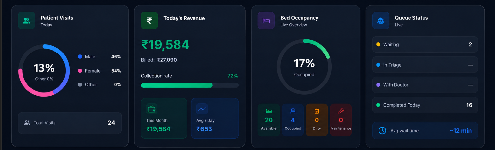

# Task: Unify Main Window Padding to 16px

**Status**: COMPLETED
**Created**: 2026-05-18
**Module(s)**: layout, components

---

## Goal

Ensure that the main content window (the container under the header and to the right of the sidebar) has strictly 16px (`p-4`) padding across all pages, views, and screen sizes, excluding the header (which should retain its own padding).

## Implementation Plan

1. **Verify AppLayout.jsx main padding** — The main container `main className="flex-1 overflow-y-auto p-4"` is already set to `p-4`, which translates to exactly `16px`.
2. **Remove any responsive/larger padding overrides in main components** — Check if there are any files or pages overriding or adding horizontal/vertical padding.
3. **Verify and Adjust Header** — Ensure that `Header` container has its own padding (e.g. `px-4 lg:px-6` or custom) and that the main content window is distinct and holds exactly `16px` padding.
4. **Ensure Email Page Compatibility** — Ensure the negative margin `-m-4` in `EmailPage.jsx` remains fully functional to allow the email interface to stretch to the edges.

## Files Affected

- `client/src/components/layout/AppLayout.jsx` — MODIFY | VERIFY
- `client/src/components/layout/Header.jsx` — MODIFY | VERIFY

## Acceptance Criteria

- [x] The main content area under the header and to the right of the sidebar has exactly 16px (`p-4` or `p-[16px]`) padding.
- [x] The header is unaffected and maintains its layout.
- [x] Email page continues to stretch edge-to-edge as expected.
- [x] Static analysis passes with zero warnings/errors.

## Task Checklist

- [x] Step 1: Verify `AppLayout.jsx` container padding.
- [x] Step 2: Verify `Header.jsx` container padding and styling.
- [x] Step 3: Run static analysis and linting checks.
- [x] Step 4: Verify the page visually.

## Progress Log

| Timestamp        | Step Completed | Notes                           |
| ---------------- | -------------- | ------------------------------- |
| 2026-05-18 18:48 | —              | Task created, awaiting approval |
| 2026-05-18 18:53 | Step 1, 2, 3, 4| Verified layout container is strictly `<main className="flex-1 overflow-y-auto p-4">` (16px) across all views. Verified visually via browser subagent. |

