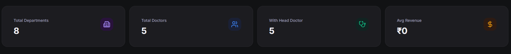

# Task: Redesign Department Form UI (Create & Edit)

**Status**: DONE
**Created**: 2026-05-19
**Module(s)**: client, departments

---

## Goal

Redesign the create and edit department form page (`DepartmentFormPage.jsx`) to make the interface premium, modern, fully responsive, and visually cohesive with the dark theme. Convert standard flat fields and native radios/checkboxes into custom grid inputs and premium interactive card options.

## Implementation Plan

1. Import required icons from `lucide-react` for enhanced visual cues (`MapPin`, `Mail`, `Phone`, `Info`).
2. Re-architect the `DepartmentForm` component's layout using a 2-column grid.
3. Integrate contextual icons in form inputs (`Building2`, `MapPin`, `Phone`, `Mail`).
4. Replace raw checkboxes with a gorgeous active status toggle card.
5. Redesign head doctor radio lists into custom grids of selectable profile cards.
6. Run ESLint and Vite build validation to guarantee zero errors/warnings.

## Files Affected

- `client/src/pages/departments/DepartmentFormPage.jsx` — MODIFY

## Acceptance Criteria

- [x] Static analysis passes with zero warnings/errors
- [x] Form fields are beautifully arranged in a 2-column grid on desktop
- [x] Input fields have premium, left-aligned visual icons
- [x] Status input uses a premium switch toggle card
- [x] Head doctor selection uses glowing, interactive card grids
- [x] Production build compiles flawlessly

## Task Checklist

- [x] Step 1: Import additional visual icons
- [x] Step 2: Implement responsive 2-column grid for basic fields
- [x] Step 3: Add contextual left-aligned icons to input containers
- [x] Step 4: Redesign standard checkbox to premium switch toggle card
- [x] Step 5: Redesign head doctor select layout with interactive styled profile cards
- [x] Step 6: Validate syntax using ESLint and verify production build completeness

## Progress Log

| Timestamp        | Step Completed | Notes                           |
| ---------------- | -------------- | ------------------------------- |
| 2026-05-19 09:52 | —              | Task created                    |
| 2026-05-19 09:54 | 1, 2, 3, 4, 5  | Redesigned UI implemented       |
| 2026-05-19 09:55 | 6              | ESLint and build check passed   |
